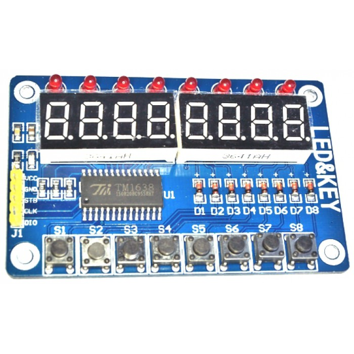

# rpi-TM1638
=============

`rpi-TM1638` is (yet another) Raspberry Pi driver for (chained) TM1638 boards like the 2$ cheap ones you can buy online.

These boards have onboard eight 7-segment displays, 8 LEDs and 8 switches.
 With few lines, you can control several TM1638 boards, and uses several LEDs, 7-segment displays and switches with few GPIOs of your Raspberry Pi.
 
 Example: suppose you have two TM1638 boards, that share DataIO on GPIO19 and the clock on GPIO13. They have their STB plugged on GPIO 6 and 26. 
 The following program turns on the LEDs #0 (3rd left of the 1st board) and #9 (2nd left of the 2nd board). It displays `12345678` on the first 7-segment display, and `2.3` on the 2nd one.
 It captures the #2 switch (3rd if tge 1st board)
  
    DIO = 19
    CLK = 13
    STB = 06, 26

    TM = TMBoards(DIO, CLK, STB, 0)

    TM.leds[3] = True
    TM.leds[9] = True

    TM.segments[0] = '12345678'
    TM.segments[10] = '2.3'
    
    a = TM.switches[2]

The `rpi-TM1638` proposes a two-level API:
- The class `chainedTM1638` proposes low-level function to manipulate the TM chips:
  - `turnOn(brightness)`,  `turnOff` and `clearDisplay` to turn on/off the displays, clear the displays or set the brightness
  - `sendCommand` and `sendData` to talk with the TM chip
  - plus some intern functions (to change the data mode, etc.)
- The class `TMboards` (that inherits from `chainedTM1638`) proposes somes methods to manipulate the LEDs, 7-segment displays and switches, with some getter/setter on the properties:
  - `leds`: for the leds
  - `segments`: for the 7-segment displays
  - `switches`: for the switches
  
  
To use the package, you just need to create a `TMboards` object or create a class that inherits from `TMboards` and proposes some high-level properties on top of it.
